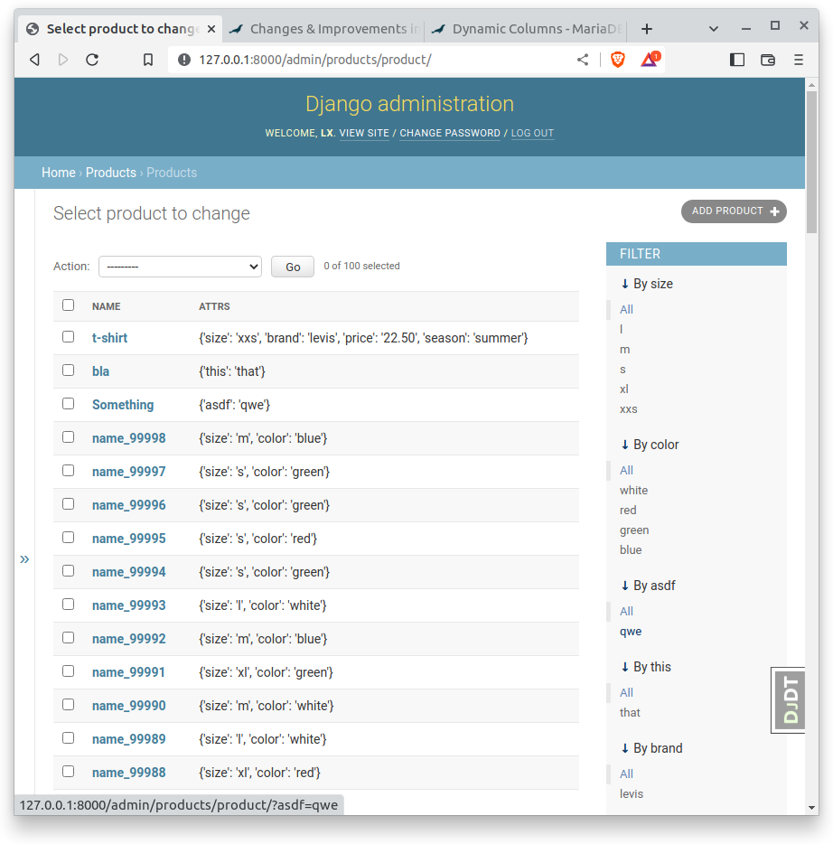
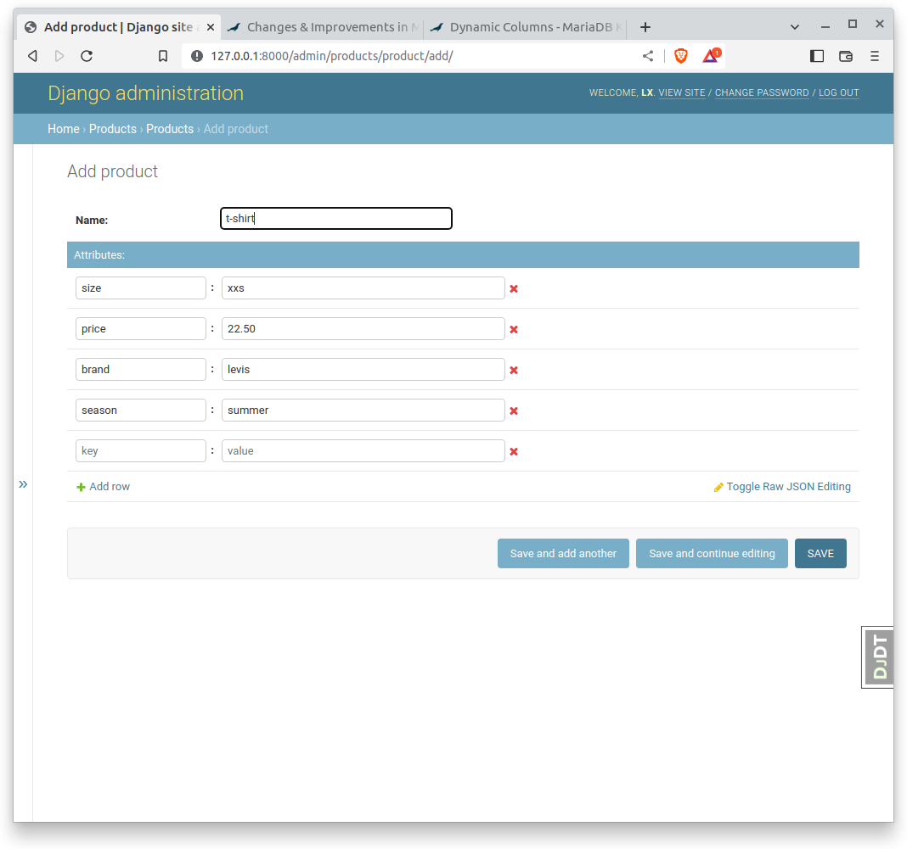

Proof of Concept using MariaDB Dynamic Column in Django.
(https://mariadb.com/kb/en/dynamic-columns/)

Results:
Performance of Filtering & searching in a large dynamic table is decent.
A typical filter on 1M records takes 20-70ms (90ms max) on a simple development machine, without caching.
This could be optimized further using caching and possibly by defining some types in the table specs.
Needs further testing to see how it performs on huge amounts of records and attributes.

Features
- any amount of attributes can be added to a Product
- Filters in Django-admin are automatically created based on unique keys/values in the dynamic table.
- The admin-filters show up in the right column
- New attributes can be added using the json-widget (see screenshots below)

Usage:
- make sure MySQL or MariaDB is correctly set up as DatabaseEngine
- pip install django-mysql
- pip install django-flat-json-widget
- add 'django_mysql' and 'flat_json_widget' to INSTALLED_APPS
- add 'products' (this app) to INSTALLED_APPS
- run migrations to create the Products table

Initial test-data can be generated using

     from random import randint
     import random
    
     for i in range(100000):
         s = str(i)
         r = str(randint(1, 20))
         Product.objects.create(name="name_" + s, attrs={"size": random.choice(['s', 'm', 'l', 'xl']),
                                                         "color": random.choice(['red', 'blue', 'green', 'white'])})

Todo:
- Editing the Product-attributes is not yet implemented
- Check how it compares with Postgres HStore/JSONb 
- Currently, when new attributes are added, a reload is required to have it show up in the admin-filters

